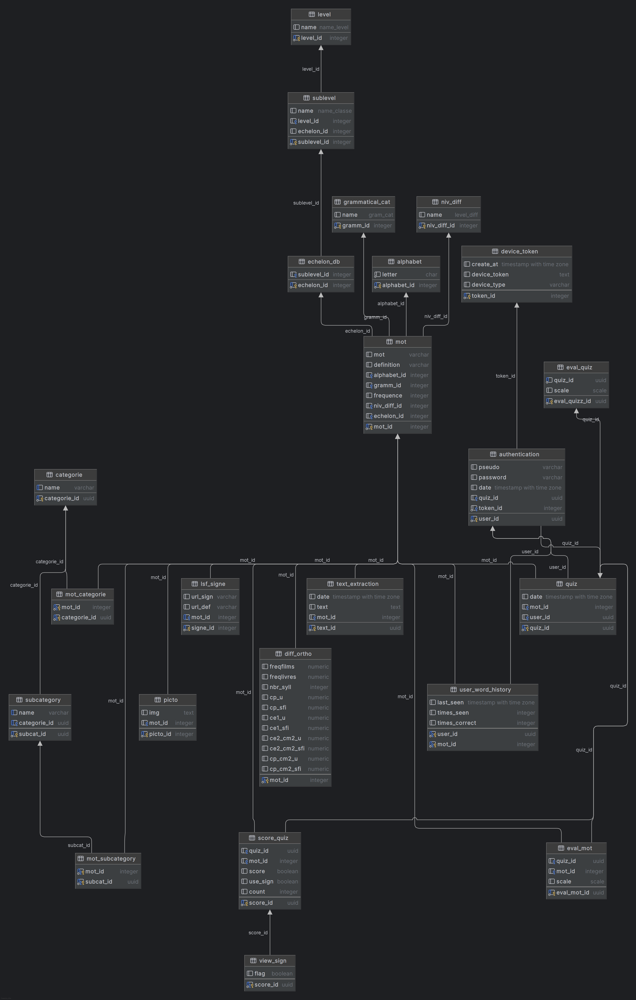

# Database Documentation

## Overview
This database schema is designed for two applications: **Vocabulo Quizz** and **Vocabulo Junior**. 
* Vocabulo Quizz is aimed at enhancing written French learning for the deaf community,
using the Elix dictionary for both words and LSF (French Sign Language) signs. 
It features a daily quiz system powered by a hybrid machine learning recommendation model,
as well as thematic quizzes. 
* Vocabulo Junior focuses on making children's literature more accessible to the deaf community,
leveraging the Elix dictionary for words and LSF signs. It includes an OCR model combined with 
CamemBERT and spaCy to detect words and map them to the appropriate entries in the database, 
depending on the context.

## Tables

### 1. mot (Word)

This table stores information about individual words in the vocabulary learning system.

* Primary key: `mot_id` (SERIAL) - Auto-incrementing unique identifier for each word
* Fields:
  - `mot`: The word itself (VARCHAR)
  - `definition`: Definition of the word (VARCHAR)
  - `alphabet_id`: Foreign key to alphabet table (INTEGER) Represents the first letter of the word
  - `gramm_id`: Foreign key to grammatical_cat table (INTEGER) Represents the grammatical category of the word
  - `frequence`: Frequency of the word (INTEGER) Score calculate to affect difficulty
  - `niv_diff_id`: Foreign key to niv_diff table (INTEGER) Represents the difficulty level of the word (3 levels)
  - `echelon_id`: Foreign key to echelon_db table (INTEGER) Represents the educational level associated with the word 
  (Echelon of Dubois Buyles)
  
* Relationships
  - One-to-One with lsf_signe
  - One-to-Many with picto
  - Many-to-Many with categorie through mot_categorie
  - Many-to-Many with subcategory through mot_subcategory
  - One-to-Many with quiz
  - One-to-Many with score_quiz
  - One-to-Many with eval_mot
  - One-to-Many with text_extraction
  - One-to-One with diff_ortho
  - Many-to-Many with authentication through user_word_history

### 2. alphabet

Stores individual letters of the alphabet.

- Primary key: `alphabet_id` (INTEGER)
- Fields:
  - `letter`: The letter (CHAR)
- Relationships

  - One-to-Many with mot

### 3. grammatical_cat (Grammatical Category)

Defines grammatical categories for words.

- Primary key: `gramm_id` (INTEGER)
- Fields:
  - `name`: Name of the grammatical category (GRAM_CAT ENUM)
- Relationships

    - One-to-Many with mot

### 4. niv_diff (Difficulty Level)

Defines difficulty levels for words ('easy', 'medium', 'hard').

- Primary key: `niv_diff_id` (INTEGER)
- Fields:
  - `name`: Name of the difficulty level (LEVEL_DIFF ENUM)
- Relationships
    - One-to-Many with mot

### 5. echelon_db

Represents educational echelons based on Dubois-Buyles classification (1 to 42) .

- Primary key: `echelon_id` (INTEGER)
- Fields:
  - `sublevel_id`: Foreign key to sublevel table (INTEGER) Level class school
- Relationships
    - One-to-Many with mot
    - Many-to-One with sublevel

### 6. level

Defines general educational levels ('primaire', 'collège', 'lycée', 'suppérieur').

- Primary key: `level_id` (INTEGER)
- Fields:
  - `name`: Name of the level (NAME_LEVEL ENUM)
- Relationships
    - One-to-Many with sublevel

### 7. sublevel

Defines specific educational sublevels within general levels ('CP' to 'université').

- Primary key: `sublevel_id` (INTEGER)
- Fields:
  - `name`: Name of the sublevel (NAME_CLASSE ENUM)
  - `level_id`: Foreign key to level table (INTEGER)
  - `echelon_id`: Foreign key to echelon_db table (INTEGER)
- Relationships
    - Many-to-One with level
    - One-to-One with echelon_db

### 8. lsf_signe (Sign Language Sign)

Stores sign language equivalents for words or definition of words (source Elix Dico).

- Primary key: `signe_id` (SERIAL)
- Fields:
  - `url_sign`: URL to the sign video (VARCHAR)
  - `url_def`: URL to the definition video (VARCHAR)
  - `mot_id`: Foreign key to mot table (INTEGER, UNIQUE)
- Relationships
  - One-to-One with mot

### 9. picto (Pictogram)
Stores pictographic representations of words.

- Primary key: `picto_id` (INTEGER)
- Fields:
  - `img`: Image data or URL (TEXT)
  - `mot_id`: Foreign key to mot table (INTEGER)
- Relationships
  - Many-to-One with mot

### 10. categorie (Category)
Defines categories for words (example : 'Habitat', 'basique', 'aliments'...).

- Primary key: `categorie_id` (UUID)
- Fields:
  - `name`: Name of the category (VARCHAR, UNIQUE)
- Relationships
    - Many-to-Many with mot through mot_categorie
    - One-to-Many with subcategory

### 11. subcategory
Defines subcategories within main categories ('fruits', 'légumes', 'musique' etc..).

- Primary key: `subcat_id` (UUID)
- Fields:
  - `name`: Name of the subcategory (VARCHAR)
  - `categorie_id`: Foreign key to categorie table (UUID)
- Relationships
  - Many-to-One with categorie
  - Many-to-Many with mot through mot_subcategory

### 12. mot_categorie (Word-Category Association)
Associates words with categories.

- Composite primary key: (`mot_id`, `categorie_id`)
- Fields:
  - `mot_id`: Foreign key to mot table (INTEGER)
  - `categorie_id`: Foreign key to categorie table (UUID)
- Relationships
  - Many-to-One with mot
  - Many-to-One with categorie

### 13. mot_subcategory (Word-Subcategory Association)
- Composite primary key: (`mot_id`, `subcat_id`)
- Fields:
  - `mot_id`: Foreign key to mot table (INTEGER)
  - `subcat_id`: Foreign key to subcategory table (UUID)
- Relationships
  - Many-to-One with mot
  - Many-to-One with subcategory

### 14. quiz
Stores information about individual quizzes taken by users.

- Primary key: `quiz_id` (UUID)
- Fields:
  - `date`: Date and time of the quiz (TIMESTAMPTZ)
  - `mot_id`: Foreign key to mot table (INTEGER)
  - `user_id`: Foreign key to authentication table (UUID)
- Relationships
  - Many-to-One with mot
  - Many-to-One with authentication
  - One-to-Many with score_quiz
  - One-to-One with eval_quiz
  - One-to-Many with eval_mot

### 15. score_quiz (Quiz Score)
Stores scores for individual words within quizzes.

- Primary key: `score_id` (UUID)
- Fields:
  - `quiz_id`: Foreign key to quiz table (UUID)
  - `mot_id`: Foreign key to mot table (INTEGER)
  - `score`: Score for the word (BOOLEAN)
  - `use_sign`: Whether sign language was used (BOOLEAN)
  - `count`: Count or attempts (INTEGER)
- Relationships
  - Many-to-One with quiz
  - Many-to-One with mot
  - One-to-One with view_sign

### 16. view_sign
Tracks whether a sign was viewed during a quiz.

- Primary key: `score_id` (UUID, foreign key to score_quiz table)
- Fields:
  - `flag`: Flag for viewing sign (BOOLEAN, DEFAULT TRUE)
- Relationships
  - One-to-One with score_quiz

### 17. authentication
Stores user authentication information.

- Primary key: `user_id` (UUID)
- Fields:
  - `pseudo`: User's pseudonym (VARCHAR)
  - `password`: User's password (VARCHAR)
  - `date`: Registration date (TIMESTAMPTZ)
  - `quiz_id`: Foreign key to quiz table (UUID)
  - `token_id`: Foreign key to device_token table (SERIAL)
- Relationships
  - One-to-Many with quiz
  - Many-to-One with device_token
  - Many-to-Many with mot through user_word_history

### 18. eval_quiz (Quiz Evaluation)
Stores overall evaluations for quizzes.

- Primary key: `eval_quizz_id` (UUID)
- Fields:
  - `quiz_id`: Foreign key to quiz table (UUID, UNIQUE)
  - `scale`: Evaluation scale (SCALE ENUM)
- Relationships
  - One-to-One with quiz

### 19. eval_mot (Word Evaluation)
Stores evaluations for individual words within quizzes.

- Primary key: `eval_mot_id` (UUID)
- Fields:
  - `quiz_id`: Foreign key to quiz table (UUID)
  - `mot_id`: Foreign key to mot table (INTEGER)
  - `scale`: Evaluation scale (SCALE ENUM)
- Relationships
  - Many-to-One with quiz
  - Many-to-One with mot

### 20. text_extraction
Ig necessary, stores extracted text associated with words.

- Primary key: `text_id` (UUID)
- Fields:
  - `date`: Extraction date (TIMESTAMPTZ)
  - `text`: Extracted text (TEXT)
  - `mot_id`: Foreign key to mot table (INTEGER)
- Relationships
  - Many-to-One with mot

### 21. device_token
Stores device tokens for user authentication.

- Primary key: `token_id` (SERIAL)
- Fields:
  - `create_at`: Token creation date (TIMESTAMPTZ)
  - `device_token`: Device token (TEXT)
  - `device_type`: Type of device (VARCHAR)
- Relationships
- One-to-Many with authentication

### 22. diff_ortho (Orthographic Difficulty)
Stores orthographic difficulty metrics for words.

- Primary key: `mot_id` (INTEGER, foreign key to mot table)
- Fields:
  - `freqfilms`: Frequency in films (DECIMAL)
  - `freqlivres`: Frequency in books (DECIMAL)
  - `nbr_syll`: Number of syllables (INTEGER)
  - `cp_u`, `cp_sfi`, `ce1_u`, `ce1_sfi`, `ce2_cm2_u`, `ce2_cm2_sfi`, `cp_cm2_u`, `cp_cm2_sfi`: Various difficulty metrics (DECIMAL)
- Relationships
  - One-to-One with mot
  
### 23. user_word_history
Tracks user interaction history with words.

- Composite primary key: (`user_id`, `mot_id`)
- Fields:
  - `user_id`: Foreign key to authentication table (UUID)
  - `mot_id`: Foreign key to mot table (INTEGER)
  - `last_seen`: Last time the word was seen (TIMESTAMP WITH TIME ZONE)
  - `times_seen`: Number of times the word was seen (INTEGER, DEFAULT 0)
  - `times_correct`: Number of times the word was correctly answered (INTEGER, DEFAULT 0)
- Relationships
  - Many-to-One with authentication
  - Many-to-One with mot

## Enums
- `scale`: 'Trop dur', 'Bien', 'Trop facile'
- `name_level`: 'primaire', 'collège', 'lycée', 'supérieur'
- `name_classe`: 'CP', 'CE1', 'CE2', 'CM1', 'CM2', 'sixième', 'cinquième', 'quatrième', 'troisième', 'seconde', 'première', 'terminale', 'université'
- `level_diff`: 'easy', 'medium', 'hard'
- `gram_cat`: 'nom', 'verbe', 'adjectif', 'préposition', 'déterminent', 'pronom', 'nom propre', 'adverbe', 'conjonction', 'interjection'

## Relationships
- Words (`mot`) are categorized into categories and subcategories.
- Words have associated sign language signs, pictograms, and orthographic difficulty information.
- Quizzes are linked to users and words, with scoring and evaluation mechanisms.
- User authentication is tied to device tokens and quiz history.
- Words are organized into levels, sublevels, and echelons for difficulty grading.

## Schema
This schema provides a comprehensive structure for managing a language learning application,
including vocabulary, user progress tracking, and multi-modal learning support (text, sign language,
pictograms).

